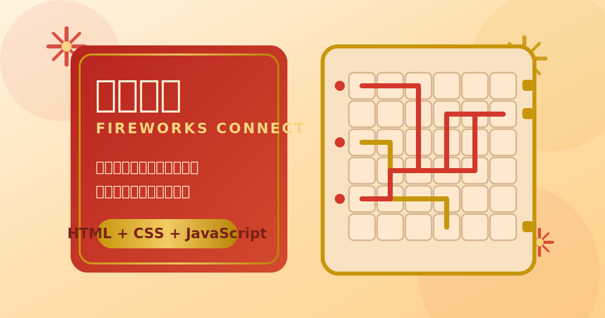

# 烟花连通 Fireworks Connect



一个适合移动端和桌面浏览器游玩的节庆风管道连通小游戏。玩家需要旋转棋盘中的管道，让左侧火源成功连通右侧火箭，在限定时间内点火结算，获得更高分数并推进关卡。

在线体验：
`https://ptao73.github.io/fireworks-connect/`

## 特性

- 纯静态前端实现，无需构建，打开即可运行
- 10 个难度递进的关卡，限时与过关门槛逐步提高
- 关卡由脚本生成，保证可解并包含分支、交叉与桥接结构
- 结算包含连通得分与时间奖励，支持一火多连策略
- 内置 Web Audio 背景音乐与音效，增强节庆氛围
- 面向移动端优化，支持触控操作和自适应布局

## 玩法说明

1. 点击棋盘中的格子旋转管道。
2. 观察左侧火源与右侧火箭的位置，尽量让更多火箭被连通。
3. 准备完成后点击“点火”触发结算。
4. 连通数量越多，单个火源的得分越高，剩余时间还会转换为奖励分。

## 计分规则

- 单个火源连通 `N` 个火箭时，得分为 `N x 100 x N`
- 时间奖励为 `剩余秒数 x 当前关卡编号`
- 前两关按点燃火箭数量判定过关，后续关卡按总分判定

## 本地运行

这是一个纯静态项目，推荐使用本地 HTTP 服务运行，避免浏览器对脚本或音频策略的限制。

```bash
python3 -m http.server 8080
```

然后访问：
`http://localhost:8080`

也可以直接双击 `index.html` 打开，但部分浏览器下的音频初始化体验会不如本地服务稳定。

## 部署方式

仓库已配置 GitHub Pages 工作流。代码推送到 `main` 分支后，GitHub Actions 会自动发布当前目录下的静态文件。

首次启用时请在 GitHub 仓库设置中确认：

- `Settings -> Pages -> Source` 使用 `GitHub Actions`
- Actions 运行成功后，站点地址为 `https://ptao73.github.io/fireworks-connect/`

## 项目结构

```text
.
├── assets/              # README 封面等静态资源
├── game.js              # 游戏主逻辑、音效、动画、结算
├── index.html           # 页面结构
├── levels.js            # 可解关卡生成与关卡参数
├── style.css            # 视觉样式与动效
└── .github/workflows/   # GitHub Pages 自动部署
```

## 技术栈

- HTML5
- CSS3
- Vanilla JavaScript
- Web Audio API
- GitHub Pages

## 许可证

本项目使用 [MIT License](./LICENSE)。
